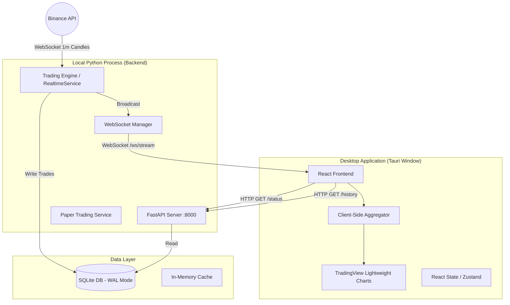

# Design Document: Desktop Trading Dashboard

## Overview

Hệ thống **Hinto Trader Pro Desktop** là ứng dụng native desktop cho trading cryptocurrency, được xây dựng theo kiến trúc Client-Server Local. Frontend sử dụng Tauri + React + TypeScript, backend sử dụng FastAPI + Python. Giao tiếp qua HTTP REST (dữ liệu tĩnh) và WebSocket (real-time streaming).

**Mục tiêu chính:**
- Hiệu năng cao (60fps) với giao diện chuyên nghiệp như Binance Desktop
- Real-time price updates qua WebSocket với latency < 100ms
- Paper trading 7 ngày trước khi trade thật
- Chiến lược Trend Pullback (VWAP + Bollinger Bands + StochRSI) trên khung 15m/1h

**Nguyên tắc thiết kế:**
- Single Source of Truth: Trading Engine là nguồn dữ liệu duy nhất
- Client-Side Aggregation: Frontend tự tổng hợp nến 1m thành 15m/1h
- Non-blocking Backend: API không bị block bởi Trading Engine
- Graceful Degradation: Hệ thống tiếp tục hoạt động khi có lỗi kết nối

## Architecture

### System Architecture Diagram



### Layer Architecture

| Layer | Technology | Responsibility |
|-------|------------|----------------|
| **Presentation** | Tauri + React + TypeScript | UI rendering, user interaction, client-side aggregation |
| **API Gateway** | FastAPI | REST endpoints, WebSocket management, CORS handling |
| **Application** | Python Services | Trading logic, signal generation, paper trading |
| **Domain** | Python Entities | Candle, Signal, Position, Trade entities |
| **Infrastructure** | SQLite, Binance API | Data persistence, external API integration |

### Communication Patterns

1. **HTTP REST** - Dữ liệu tĩnh (history, status, settings)
2. **WebSocket** - Real-time streaming (price updates, signals)
3. **Pub/Sub** - Internal event broadcasting (Engine → WebSocket Manager)

## Components and Interfaces

### Backend Components

#### 1. FastAPI Server (`src/api/main.py`)

```python
# Endpoints
GET  /system/status     → SystemStatus
GET  /market/history    → List[CandleData]
GET  /ws/history/{symbol}?timeframe={tf} → List[CandleWithIndicators]
POST /settings          → SettingsResponse
WS   /ws/stream/{symbol} → Real-time CandleStream
```

#### 2. WebSocket Manager (`src/api/routers/market.py`)

```python
class WebSocketManager:
    """Manages WebSocket connections with Pub/Sub pattern."""
    
    async def connect(websocket: WebSocket) -> None
    async def disconnect(websocket: WebSocket) -> None
    async def broadcast(data: dict) -> None
```

#### 3. RealtimeService (`src/application/services/realtime_service.py`)

```python
class RealtimeService:
    """Singleton service orchestrating real-time data flow."""
    
    async def start() -> None
    async def stop() -> None
    def get_candles(timeframe: str, limit: int) -> List[Candle]
    def get_historical_data_with_indicators(timeframe: str, limit: int) -> List[Dict]
    def get_latest_indicators(timeframe: str) -> Dict[str, float]
    def subscribe_signals(callback: Callable) -> None
```

#### 4. PaperTradingService (`src/application/services/paper_trading_service.py`)

```python
class PaperTradingService:
    """Manages paper trading portfolio and execution."""
    
    def on_signal_received(signal: TradingSignal, symbol: str) -> None
    def process_market_data(current_price: float, high: float, low: float) -> None
    def get_portfolio() -> Portfolio
    def get_trade_history(page: int, limit: int) -> PaginatedTrades
    def calculate_performance() -> PerformanceMetrics
```

### Frontend Components

#### 1. CandleChart (`frontend/src/components/CandleChart.tsx`)

```typescript
interface CandleChartProps {
    symbol: string;
    defaultTimeframe: '15m' | '1h';
}

// Features:
// - TradingView Lightweight Charts integration
// - VWAP overlay (orange, linewidth: 2)
// - Bollinger Bands overlay (cyan, opacity: 0.5)
// - Client-side candle aggregation
// - Signal markers (green/red arrows)
```

#### 2. Client-Side Aggregator

```typescript
// Aggregation Logic
function aggregateCandle(
    incoming1mCandle: Candle,
    currentCandle: AggregatedCandle | null,
    timeframe: '15m' | '1h'
): AggregatedCandle {
    const intervalSeconds = timeframe === '15m' ? 900 : 3600;
    const candleStartTime = Math.floor(incoming1mCandle.time / intervalSeconds) * intervalSeconds;
    
    if (currentCandle && currentCandle.time === candleStartTime) {
        // Update existing candle
        return {
            ...currentCandle,
            high: Math.max(currentCandle.high, incoming1mCandle.high),
            low: Math.min(currentCandle.low, incoming1mCandle.low),
            close: incoming1mCandle.close
        };
    } else {
        // New candle
        return {
            time: candleStartTime,
            open: incoming1mCandle.open,
            high: incoming1mCandle.high,
            low: incoming1mCandle.low,
            close: incoming1mCandle.close
        };
    }
}
```

#### 3. PriceTicker (`frontend/src/components/PriceTicker.tsx`)

```typescript
interface PriceTickerProps {
    symbol: string;
}

// Features:
// - Real-time price display
// - Price change indicator (green/red)
// - Connection status indicator
```

### API Contracts

#### GET /ws/history/{symbol}

```json
// Request
GET /ws/history/btcusdt?timeframe=15m

// Response
[
    {
        "time": 1700000000,
        "open": 95000.0,
        "high": 95500.0,
        "low": 94800.0,
        "close": 95200.0,
        "volume": 1234.56,
        "vwap": 95100.0,
        "bb_upper": 96000.0,
        "bb_middle": 95000.0,
        "bb_lower": 94000.0
    }
]
```

#### WebSocket /ws/stream/{symbol}

```json
// Message Format
{
    "type": "candle",
    "symbol": "btcusdt",
    "timestamp": "2025-11-25T10:00:00Z",
    "open": 95000.0,
    "high": 95500.0,
    "low": 94800.0,
    "close": 95200.0,
    "volume": 123.45,
    "vwap": 95100.0,
    "bollinger": {
        "upper_band": 96000.0,
        "middle_band": 95000.0,
        "lower_band": 94000.0
    },
    "stoch_rsi": {
        "k": 45.5,
        "d": 42.3
    }
}
```

## Data Models

### Domain Entities

#### Candle

```python
@dataclass
class Candle:
    timestamp: datetime
    open: float
    high: float
    low: float
    close: float
    volume: float
    
    def to_dict(self) -> Dict[str, Any]
```

#### TradingSignal

```python
@dataclass
class TradingSignal:
    signal_type: SignalType  # BUY, SELL, NEUTRAL
    entry_price: float
    stop_loss: float
    take_profit: float
    confidence: float  # 0.0 - 1.0
    risk_reward_ratio: float
    timestamp: datetime
    metadata: Dict[str, Any]
```

#### PaperTrade

```python
@dataclass
class PaperTrade:
    id: str
    symbol: str
    direction: TradeDirection  # LONG, SHORT
    entry_price: float
    exit_price: Optional[float]
    size: float
    entry_time: datetime
    exit_time: Optional[datetime]
    pnl: Optional[float]
    status: TradeStatus  # OPEN, CLOSED
    signal_metadata: Dict[str, Any]
```

#### Portfolio

```python
@dataclass
class Portfolio:
    balance: float
    equity: float
    unrealized_pnl: float
    realized_pnl: float
    open_positions: List[PaperTrade]
```

#### PerformanceMetrics

```python
@dataclass
class PerformanceMetrics:
    total_trades: int
    winning_trades: int
    losing_trades: int
    win_rate: float
    profit_factor: float
    max_drawdown: float
    total_pnl: float
    average_rr: float
```

### Database Schema

```sql
-- Paper Trades Table
CREATE TABLE paper_trades (
    id TEXT PRIMARY KEY,
    symbol TEXT NOT NULL,
    direction TEXT NOT NULL,
    entry_price REAL NOT NULL,
    exit_price REAL,
    size REAL NOT NULL,
    entry_time TEXT NOT NULL,
    exit_time TEXT,
    pnl REAL,
    status TEXT NOT NULL,
    signal_metadata TEXT,  -- JSON
    created_at TEXT DEFAULT CURRENT_TIMESTAMP
);

-- Settings Table
CREATE TABLE settings (
    key TEXT PRIMARY KEY,
    value TEXT NOT NULL,
    updated_at TEXT DEFAULT CURRENT_TIMESTAMP
);

-- Index for performance
CREATE INDEX idx_paper_trades_status ON paper_trades(status);
CREATE INDEX idx_paper_trades_entry_time ON paper_trades(entry_time);
```


## Correctness Properties

*A property is a characteristic or behavior that should hold true across all valid executions of a system-essentially, a formal statement about what the system should do. Properties serve as the bridge between human-readable specifications and machine-verifiable correctness guarantees.*

### Property 1: Client-Side Candle Aggregation Correctness

*For any* sequence of 1-minute candles within a 15-minute or 1-hour window, the aggregated candle SHALL have:
- `open` equal to the first 1m candle's open
- `high` equal to the maximum high across all 1m candles
- `low` equal to the minimum low across all 1m candles
- `close` equal to the last 1m candle's close

**Validates: Requirements 2.5**

### Property 2: Paper Trade Persistence Round-Trip

*For any* paper trade that is executed, serializing the trade to SQLite and then deserializing it SHALL produce an equivalent trade object with all fields preserved (id, symbol, direction, entry_price, size, entry_time, signal_metadata).

**Validates: Requirements 4.3**

### Property 3: Unrealized PnL Calculation

*For any* open position with entry_price `E`, current_price `P`, and size `S`:
- For LONG positions: unrealized_pnl = (P - E) * S
- For SHORT positions: unrealized_pnl = (E - P) * S

**Validates: Requirements 4.4**

### Property 4: Trading Engine Stability Under Connection Churn

*For any* sequence of WebSocket client connect/disconnect events (up to 100 events), the Trading Engine SHALL remain in running state and continue processing market data without interruption.

**Validates: Requirements 5.2**

### Property 5: Historical Data API Response Completeness

*For any* valid history request with timeframe parameter, the API response SHALL include for each candle:
- OHLCV data (open, high, low, close, volume)
- VWAP value (non-null number)
- Bollinger Bands values (bb_upper, bb_middle, bb_lower as non-null numbers)

**Validates: Requirements 5.4**

### Property 6: Settings Persistence and Application

*For any* settings update (risk_percent, rr_ratio), the new values SHALL be:
1. Persisted to SQLite database
2. Applied to all subsequent signal generations

**Validates: Requirements 6.3**

### Property 7: Trade History Pagination Correctness

*For any* page number `N` and page size `L`, the paginated results SHALL:
- Return at most `L` items
- Return items sorted by entry_time descending
- Not overlap with results from page `N-1` or `N+1`

**Validates: Requirements 7.1**

### Property 8: Performance Metrics Calculation

*For any* set of closed trades:
- `win_rate` = winning_trades / total_trades (where winning = pnl > 0)
- `profit_factor` = sum(winning_pnl) / abs(sum(losing_pnl))
- `max_drawdown` = maximum peak-to-trough decline in equity curve
- `total_pnl` = sum of all individual trade pnl values

**Validates: Requirements 7.3**

## Error Handling

### Backend Error Handling

| Error Type | Handling Strategy | User Feedback |
|------------|-------------------|---------------|
| WebSocket Disconnect | Graceful cleanup, remove from broadcast list | Frontend shows "Disconnected" |
| Binance API Timeout | Retry with exponential backoff (max 3 attempts) | Log warning, continue with cached data |
| Database Write Failure | Rollback transaction, log error | Return 500 with error message |
| Invalid Request | Validate with Pydantic, return 400 | Return validation error details |

### Frontend Error Handling

| Error Type | Handling Strategy | User Feedback |
|------------|-------------------|---------------|
| WebSocket Disconnect | Auto-reconnect every 5 seconds | Show "Reconnecting..." indicator |
| API Request Failure | Retry once, then show error | Toast notification with retry button |
| Chart Data Error | Fallback to last valid data | Show "Data unavailable" overlay |
| Invalid Timeframe | Default to 15m | Silent fallback |

### Error Response Format

```json
{
    "error": {
        "code": "VALIDATION_ERROR",
        "message": "Invalid timeframe parameter",
        "details": {
            "field": "timeframe",
            "value": "5m",
            "allowed": ["1m", "15m", "1h"]
        }
    }
}
```

## Testing Strategy

### Dual Testing Approach

Hệ thống sử dụng cả **Unit Tests** và **Property-Based Tests** để đảm bảo correctness:

- **Unit Tests**: Verify specific examples, edge cases, và error conditions
- **Property-Based Tests**: Verify universal properties across all valid inputs

### Property-Based Testing Framework

**Library**: `hypothesis` (Python) cho backend, `fast-check` (TypeScript) cho frontend

**Configuration**:
```python
# pytest.ini
[pytest]
hypothesis_settings = {
    "max_examples": 100,
    "deadline": 5000
}
```

### Test Categories

#### 1. Unit Tests

| Component | Test Focus |
|-----------|------------|
| CandleAggregator | Edge cases: empty input, single candle, boundary timestamps |
| PaperTradingService | Trade execution, position closing, PnL calculation |
| WebSocketManager | Connection handling, broadcast to multiple clients |
| PerformanceCalculator | Zero trades, all wins, all losses, mixed results |

#### 2. Property-Based Tests

| Property | Test Implementation |
|----------|---------------------|
| Property 1 | Generate random 1m candle sequences, verify aggregation invariants |
| Property 2 | Generate random trades, serialize/deserialize, assert equality |
| Property 3 | Generate random positions and prices, verify PnL formula |
| Property 4 | Generate random connect/disconnect sequences, verify engine state |
| Property 5 | Generate random timeframe requests, verify response schema |
| Property 6 | Generate random settings, update and verify application |
| Property 7 | Generate random page/limit combinations, verify pagination |
| Property 8 | Generate random trade sets, verify metric calculations |

### Test File Structure

```
tests/
├── unit/
│   ├── test_candle_aggregator.py
│   ├── test_paper_trading_service.py
│   ├── test_websocket_manager.py
│   └── test_performance_calculator.py
├── property/
│   ├── test_aggregation_properties.py
│   ├── test_persistence_properties.py
│   ├── test_pnl_properties.py
│   ├── test_stability_properties.py
│   ├── test_api_properties.py
│   ├── test_settings_properties.py
│   ├── test_pagination_properties.py
│   └── test_metrics_properties.py
└── integration/
    ├── test_api_endpoints.py
    └── test_websocket_flow.py
```

### Property Test Annotation Format

Mỗi property test PHẢI được annotate với format:
```python
# **Feature: desktop-trading-dashboard, Property 1: Client-Side Candle Aggregation Correctness**
# **Validates: Requirements 2.5**
```
