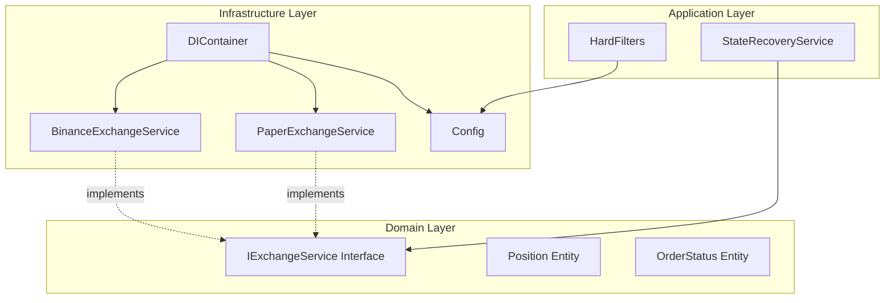
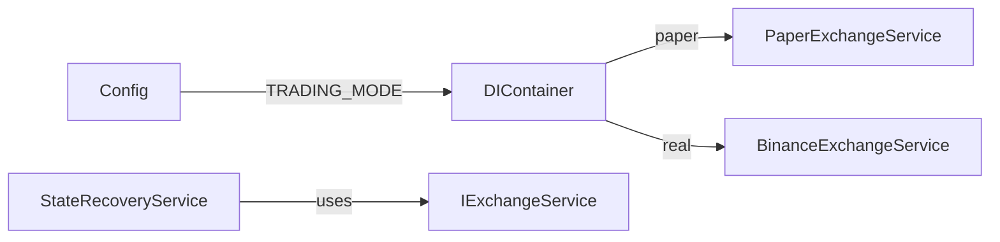

# Design Document - Expert Feedback 3

## Overview

Tài liệu thiết kế này mô tả kiến trúc và implementation cho 3 cải tiến theo phản hồi chuyên gia:
1. Exchange Service Abstraction - Tách paper trading khỏi real exchange
2. Configuration Management - Đưa hardcoded values vào config
3. HALTED State Safety - Tăng cường an toàn cho trạng thái HALTED

## Architecture

### Component Diagram



### Dependency Flow



## Components and Interfaces

### 1. IExchangeService Interface

**Location:** `src/domain/interfaces/i_exchange_service.py`

```python
from abc import ABC, abstractmethod
from typing import List, Optional
from dataclasses import dataclass

@dataclass
class Position:
    """Represents an open trading position."""
    symbol: str
    side: str  # 'LONG' | 'SHORT'
    size: float
    entry_price: float
    unrealized_pnl: float = 0.0

@dataclass
class OrderStatus:
    """Represents order status from exchange."""
    order_id: str
    status: str  # 'NEW' | 'FILLED' | 'CANCELED' | 'REJECTED'
    filled_qty: float
    avg_price: Optional[float] = None

class IExchangeService(ABC):
    """
    Abstract interface for exchange operations.
    Enables switching between paper and live trading.
    """
    
    @abstractmethod
    async def get_position(self, symbol: str) -> Optional[Position]:
        """Get open position for symbol."""
        pass
    
    @abstractmethod
    async def get_order_status(self, symbol: str, order_id: str) -> OrderStatus:
        """Get status of a specific order."""
        pass
    
    @abstractmethod
    def get_exchange_type(self) -> str:
        """Return 'paper' or 'binance'."""
        pass
```

### 2. PaperExchangeService

**Location:** `src/infrastructure/exchange/paper_exchange_service.py`

```python
class PaperExchangeService(IExchangeService):
    """Paper trading implementation using local database."""
    
    def __init__(self, order_repository: IOrderRepository):
        self._order_repository = order_repository
        self.logger = logging.getLogger(__name__)
    
    async def get_position(self, symbol: str) -> Optional[Position]:
        """Query local database for simulated positions."""
        orders = self._order_repository.get_orders_by_symbol(symbol)
        return self._calculate_position_from_orders(orders)
    
    def get_exchange_type(self) -> str:
        return "paper"
```

### 3. BinanceExchangeService

**Location:** `src/infrastructure/exchange/binance_exchange_service.py`

```python
class BinanceExchangeService(IExchangeService):
    """Real Binance exchange implementation."""
    
    def __init__(self, rest_client: BinanceRestClient):
        self._rest_client = rest_client
        self.logger = logging.getLogger(__name__)
    
    async def get_position(self, symbol: str) -> Optional[Position]:
        """Query Binance API for real positions."""
        positions_data = await self._rest_client.get_positions(symbol)
        # Convert to Position entity
        ...
    
    def get_exchange_type(self) -> str:
        return "binance"
```

### 4. Enhanced Config

**Location:** `src/config.py` (additions)

```python
@dataclass
class BookTickerConfig:
    """BookTicker stream configuration."""
    max_age_seconds: float = 2.0  # Default per expert recommendation
    
    def validate(self):
        if self.max_age_seconds <= 0:
            raise ValueError("max_age_seconds must be positive")

@dataclass  
class SafetyConfig:
    """Safety and recovery configuration."""
    allow_auto_resume_from_halted: bool = False
    
class Config:
    def __init__(self):
        # ... existing config
        self.book_ticker = BookTickerConfig(
            max_age_seconds=float(os.getenv('MAX_BOOK_TICKER_AGE_SECONDS', '2.0'))
        )
        self.safety = SafetyConfig(
            allow_auto_resume_from_halted=os.getenv('ALLOW_AUTO_RESUME_FROM_HALTED', 'false').lower() == 'true'
        )
        self.trading_mode = os.getenv('TRADING_MODE', 'PAPER')
```

## Data Models

### Position Entity
```python
@dataclass
class Position:
    symbol: str
    side: str  # 'LONG' | 'SHORT'
    size: float
    entry_price: float
    unrealized_pnl: float = 0.0
```

### OrderStatus Entity
```python
@dataclass
class OrderStatus:
    order_id: str
    status: str  # 'NEW' | 'FILLED' | 'CANCELED' | 'REJECTED'
    filled_qty: float
    avg_price: Optional[float] = None
```

### RecoveryResult (existing, enhanced)
```python
@dataclass
class RecoveryResult:
    action: str  # 'no_action' | 'restored' | 'reset' | 'blocked'
    previous_state: Optional[SystemState] = None
    current_state: Optional[SystemState] = None
    position_verified: bool = False
    message: str = ""
```

## Correctness Properties

*A property is a characteristic or behavior that should hold true across all valid executions of a system-essentially, a formal statement about what the system should do. Properties serve as the bridge between human-readable specifications and machine-verifiable correctness guarantees.*

Based on the prework analysis, the following correctness properties are identified:

### Property 1: Exchange Service Factory Correctness
*For any* TRADING_MODE configuration value, the DIContainer SHALL return the correct IExchangeService implementation type (PaperExchangeService for "PAPER", BinanceExchangeService for "REAL").
**Validates: Requirements 1.2, 1.3**

### Property 2: Position Return Type Consistency
*For any* IExchangeService implementation and any valid symbol, calling get_position() SHALL return either None or a valid Position object with all required fields populated.
**Validates: Requirements 1.4**

### Property 3: Data Freshness Comparison
*For any* data age value and any MAX_BOOK_TICKER_AGE_SECONDS config value, the BookTickerClient.is_data_fresh() SHALL return True if and only if data_age <= max_age_seconds.
**Validates: Requirements 2.3**

### Property 4: Config Validation for Non-Positive Values
*For any* non-positive value of MAX_BOOK_TICKER_AGE_SECONDS, the Config SHALL reject the value and use the default (2.0 seconds).
**Validates: Requirements 2.4**

### Property 5: HALTED State Recovery Safety
*For any* recovery scenario where persisted state is HALTED, the StateRecoveryService SHALL keep the system in HALTED state and return action="blocked".
**Validates: Requirements 3.1**

### Property 6: HALTED State Trading Prevention
*For any* trading operation attempted while system is in HALTED state, the Trading_System SHALL reject the operation.
**Validates: Requirements 3.4**

## Error Handling

### Exchange Service Errors
- Network errors: Log and return None/raise ExchangeError
- API rate limits: Implement exponential backoff
- Invalid responses: Log warning and return safe default

### Config Errors
- Invalid values: Use default and log warning
- Missing env vars: Use defaults

### Recovery Errors
- Database errors: Log and assume no persisted state
- Exchange verification errors: Assume position exists (safe default)

## Testing Strategy

### Unit Testing
- Test IExchangeService implementations independently
- Test Config loading and validation
- Test StateRecoveryService HALTED handling
- Test DIContainer factory logic

### Property-Based Testing
The following property-based tests will be implemented using `hypothesis` library:

1. **Property 1 Test**: Generate random TRADING_MODE values, verify correct service type
2. **Property 2 Test**: Generate random symbols, verify Position return type
3. **Property 3 Test**: Generate random (data_age, max_age) pairs, verify comparison
4. **Property 4 Test**: Generate non-positive floats, verify rejection
5. **Property 5 Test**: Generate HALTED recovery scenarios, verify blocked action
6. **Property 6 Test**: Generate trading operations in HALTED state, verify rejection

Each property-based test will run minimum 100 iterations.

### Integration Testing
- Test full recovery flow with paper exchange
- Test config changes don't break existing functionality
- Test DIContainer wiring
