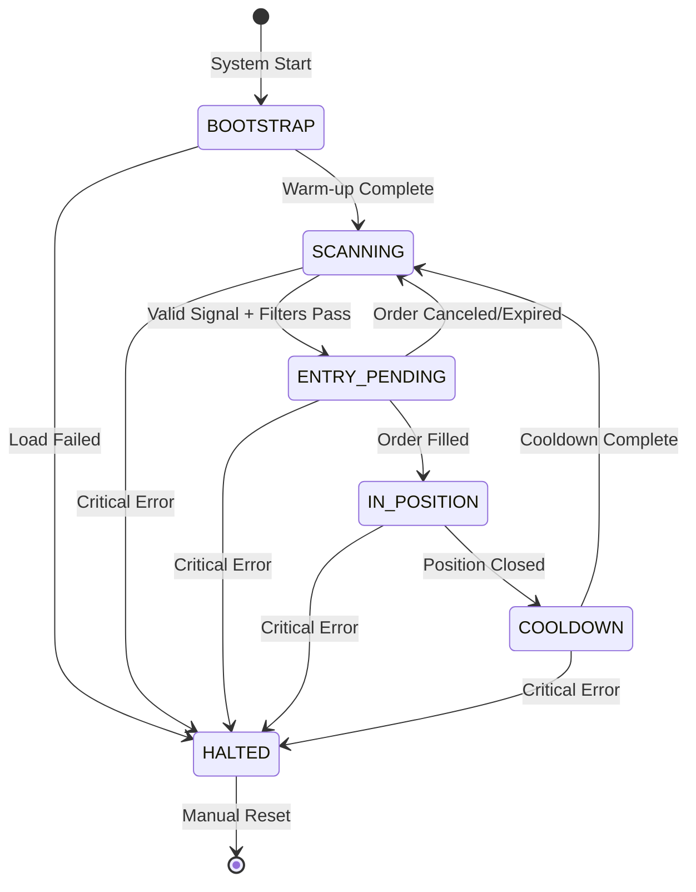
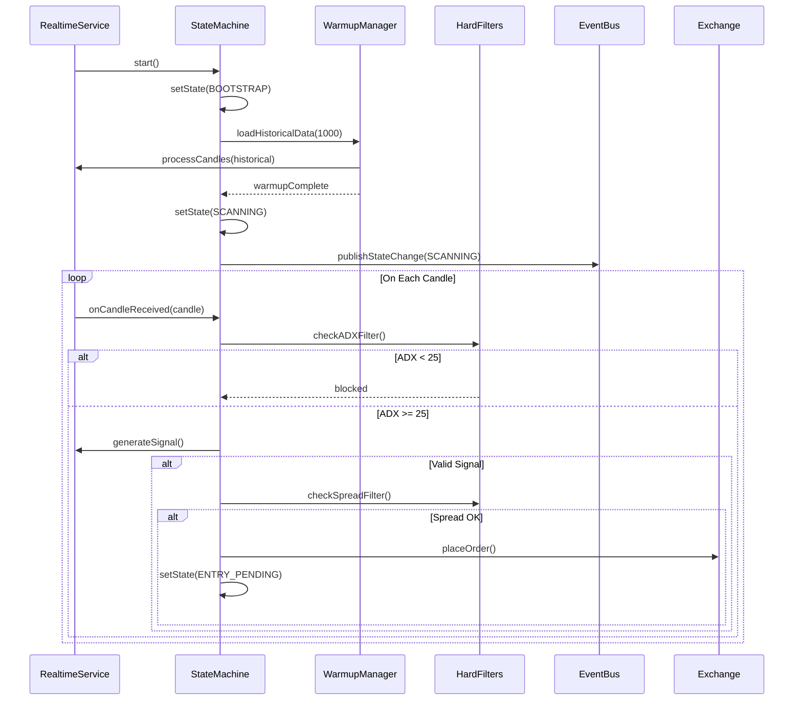

# Design Document: Trading State Machine

## Overview

Trading State Machine là "bộ não" của Bot giao dịch Hinto Stock, quản lý toàn bộ vòng đời giao dịch thông qua Finite State Machine (FSM). Hệ thống đảm bảo:

1. **Cold Start Warm-up**: Load dữ liệu lịch sử để các indicator (VWAP, StochRSI) có giá trị chính xác ngay từ đầu
2. **State Management**: Quản lý 6 trạng thái giao dịch với các transition rules rõ ràng
3. **Hard Filters**: Lọc nhiễu thị trường bằng ADX và Spread filters theo Game Theory
4. **State Persistence**: Lưu trạng thái để recovery sau restart

## Architecture



### Component Interaction



## Components and Interfaces

### 1. SystemState Enum

```python
# src/domain/state_machine.py
from enum import Enum, auto

class SystemState(Enum):
    """Trading system states."""
    BOOTSTRAP = auto()      # Loading historical data
    SCANNING = auto()       # Waiting for signals
    ENTRY_PENDING = auto()  # Order placed, waiting for fill
    IN_POSITION = auto()    # Holding position
    COOLDOWN = auto()       # Post-trade rest period
    HALTED = auto()         # Emergency stop
```

### 2. TradingStateMachine Class

```python
# src/application/services/trading_state_machine.py
class TradingStateMachine:
    """
    Finite State Machine for trading lifecycle management.
    
    Responsibilities:
    - Manage state transitions
    - Enforce transition rules
    - Publish state change events
    - Persist state for recovery
    """
    
    def __init__(
        self,
        event_bus: EventBus,
        state_repository: IStateRepository,
        adx_threshold: float = 25.0,
        spread_threshold: float = 0.001,  # 0.1%
        cooldown_candles: int = 4
    ):
        self.state = SystemState.BOOTSTRAP
        self.event_bus = event_bus
        self.state_repository = state_repository
        self.adx_threshold = adx_threshold
        self.spread_threshold = spread_threshold
        self.cooldown_candles = cooldown_candles
        self.cooldown_counter = 0
        self.current_order_id: Optional[str] = None
```

### 3. WarmupManager Class

```python
# src/application/services/warmup_manager.py
class WarmupManager:
    """
    Manages cold start data warm-up.
    
    Responsibilities:
    - Load historical candles
    - Process through indicators without triggering signals
    - Handle VWAP daily reset
    """
    
    async def warmup(
        self,
        rest_client: IRestClient,
        indicators: IndicatorBundle,
        candle_count: int = 1000
    ) -> WarmupResult:
        """Load and process historical data."""
```

### 4. HardFilters Class

```python
# src/application/services/hard_filters.py
class HardFilters:
    """
    Hard filters for signal validation.
    
    Game Theory approach: Don't play when odds are against you.
    """
    
    def check_adx_filter(
        self,
        adx_value: float,
        threshold: float = 25.0
    ) -> FilterResult:
        """Check if market is trending enough."""
    
    def check_spread_filter(
        self,
        bid: float,
        ask: float,
        threshold: float = 0.001
    ) -> FilterResult:
        """Check if spread is acceptable."""
```

### 5. IStateRepository Interface

```python
# src/domain/repositories/i_state_repository.py
class IStateRepository(ABC):
    """Interface for state persistence."""
    
    @abstractmethod
    def save_state(self, state: SystemState, order_id: Optional[str]) -> None:
        """Persist current state."""
    
    @abstractmethod
    def load_state(self) -> Optional[PersistedState]:
        """Load persisted state."""
```

## Data Models

### StateTransition

```python
@dataclass
class StateTransition:
    """Record of a state transition."""
    from_state: SystemState
    to_state: SystemState
    reason: str
    timestamp: datetime
    order_id: Optional[str] = None
```

### WarmupResult

```python
@dataclass
class WarmupResult:
    """Result of warm-up process."""
    success: bool
    candles_processed: int
    vwap_value: float
    stoch_rsi_k: float
    stoch_rsi_d: float
    error: Optional[str] = None
```

### FilterResult

```python
@dataclass
class FilterResult:
    """Result of filter check."""
    passed: bool
    filter_name: str
    value: float
    threshold: float
    reason: str
```

### PersistedState

```python
@dataclass
class PersistedState:
    """Persisted state for recovery."""
    state: SystemState
    order_id: Optional[str]
    position_id: Optional[str]
    timestamp: datetime
```

## Correctness Properties

*A property is a characteristic or behavior that should hold true across all valid executions of a system-essentially, a formal statement about what the system should do. Properties serve as the bridge between human-readable specifications and machine-verifiable correctness guarantees.*

### Property 1: Bootstrap Signal Suppression
*For any* sequence of historical candles processed during BOOTSTRAP state, the system shall generate zero trading signals regardless of indicator values.
**Validates: Requirements 1.2**

### Property 2: Warm-up State Transition
*For any* successful warm-up completion with at least 1000 candles, the system shall transition from BOOTSTRAP to SCANNING state and have valid VWAP value.
**Validates: Requirements 1.1, 1.3**

### Property 3: VWAP Daily Reset
*For any* sequence of candles that crosses 00:00 UTC boundary, the VWAP calculator shall reset its accumulated values at the boundary.
**Validates: Requirements 1.4**

### Property 4: State Transition Validity
*For any* state transition, the transition shall only occur between valid state pairs as defined in the FSM diagram (no invalid transitions).
**Validates: Requirements 2.2, 2.3, 2.4, 2.5, 2.6**

### Property 5: HALTED Reachability
*For any* current state (except HALTED), when a critical error occurs, the system shall transition to HALTED state.
**Validates: Requirements 2.7**

### Property 6: State Change Event Publishing
*For any* state transition, the system shall publish exactly one state change event via EventBus.
**Validates: Requirements 2.8**

### Property 7: ADX Filter Enforcement
*For any* candle received while in SCANNING state with ADX < threshold, the system shall skip signal generation and remain in SCANNING state.
**Validates: Requirements 3.1, 3.2**

### Property 8: Spread Filter Enforcement
*For any* entry order attempt with spread > threshold, the system shall cancel the entry and remain in SCANNING state.
**Validates: Requirements 4.1, 4.2, 4.3**

### Property 9: State Persistence Round-Trip
*For any* state and order_id, persisting then loading shall return the same state and order_id.
**Validates: Requirements 5.1, 5.2**

### Property 10: Cooldown Duration
*For any* entry into COOLDOWN state, the system shall wait exactly cooldown_candles before transitioning to SCANNING.
**Validates: Requirements 2.6**

## Error Handling

### Error Categories

1. **Recoverable Errors**
   - Network timeout → Retry with exponential backoff
   - Order rejected → Log and return to SCANNING
   - Data gap → Continue with available data

2. **Critical Errors (→ HALTED)**
   - Exchange connection lost during IN_POSITION
   - Position verification failed on restart
   - Multiple consecutive order failures

### Error Recovery Flow

```python
async def handle_error(self, error: Exception, context: str) -> None:
    """Handle errors based on severity."""
    if self._is_critical(error):
        await self._transition_to_halted(reason=str(error))
    else:
        self.logger.warning(f"Recoverable error in {context}: {error}")
        # Continue operation
```

## Testing Strategy

### Property-Based Testing

Sử dụng **Hypothesis** library cho Python để implement property-based tests.

```python
# tests/property/test_state_machine_properties.py
from hypothesis import given, strategies as st

@given(st.lists(st.builds(Candle, ...)))
def test_bootstrap_signal_suppression(candles):
    """
    **Feature: trading-state-machine, Property 1: Bootstrap Signal Suppression**
    """
    # Arrange
    sm = TradingStateMachine(state=SystemState.BOOTSTRAP)
    
    # Act
    signals = [sm.process_candle(c) for c in candles]
    
    # Assert
    assert all(s is None for s in signals)
```

### Unit Tests

- Test từng state transition riêng lẻ
- Test filter logic với edge cases
- Test persistence round-trip

### Integration Tests

- Test full warm-up flow với mock REST client
- Test state recovery sau restart
- Test EventBus integration

### Test Configuration

```python
# pytest.ini
[pytest]
markers =
    property: Property-based tests (run with: pytest -m property)
    unit: Unit tests
    integration: Integration tests
```

Mỗi property-based test phải chạy tối thiểu **100 iterations** để đảm bảo coverage.
